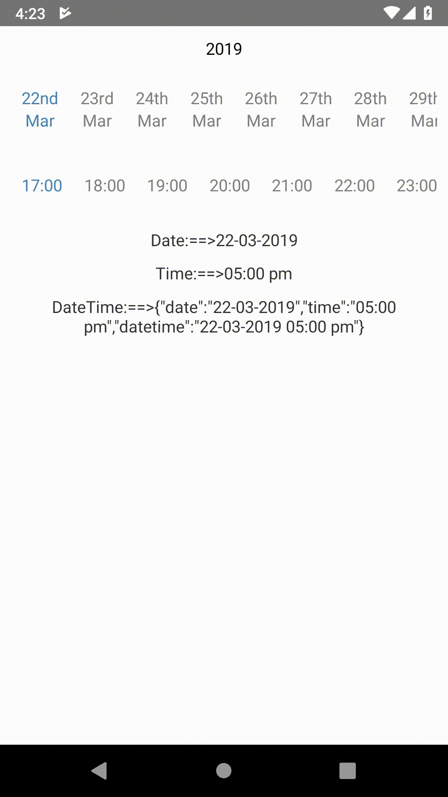

    
    
    

### React Native horizontal date picker

## Npm repo
https://www.npmjs.com/package/@logisticinfotech/react-native-horizontal-date-picker

## Git repo
https://github.com/logisticinfotech/react-native-datetimepicker

# Installation and Usage
Please check this blog for installation and usage [this link](https://www.logisticinfotech.com/blog/react-native-horizontal-date-picker-library/)

